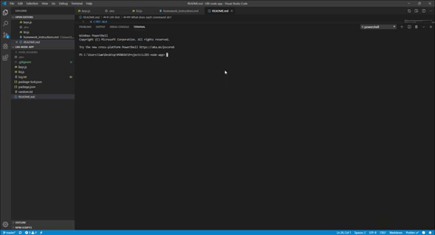
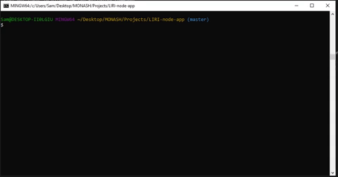
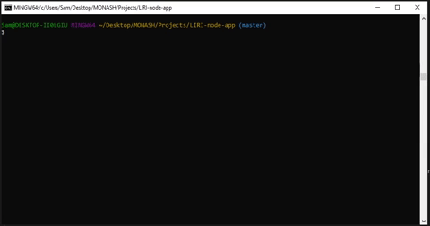
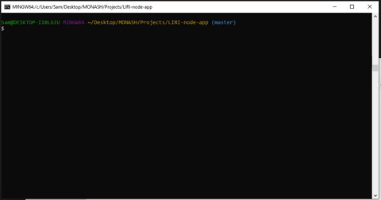
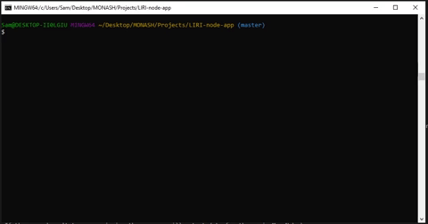

# LIRI-Bot
What is LIRI? LIRI is like iPhone's SIRI, However, while SIRI is a Speech Interpretation and Recognition Interface, LIRI is a _Language_ Interpretation and Recognition Interface. LIRI is a command line node app that takes in parameters and gives you back data.

I was the sole contributor to this application.

## How does it work?
LIRI-bot takes in either of the following commands.
* 'concert-this'
* 'spotify-this-song'
* 'movie-this'
* 'do-what-it-says'

## What does each command do?
1. 'node liri.js concert-this <artist/band name here>'
* This command searches the Bands in Town Artist Events API for an artist and renders the name of the venue, the venue location, and the date of the event, for each event to the terminal. 



2. 'node liri.js spotify-this-song <song name here>'

This will show the following information in the terminal.
  * Artist
  * The song's name
  * A preview link of the song from Spotify
  * The album that the song is from



If no song is provided then the bot will default to "The Sign" by Ace of Base.


3. 'node liri.js movie-this <movie name here>'

This searches for the movie input in the terminal following the movie-this command. It will display the following in the terminal.
  * Title of the movie.
  * Year the movie came out.
  * IMDB Rating of the movie.
  * Rotten Tomatoes Rating of the movie.
  * Country where the movie was produced.
  * Language of the movie.
  * Plot of the movie.
  * Actors in the movie. 



If the user doesn't type a movie in, the program will output data for the movie Mr. Nobody



4. 'node liri.js do-what-it-says'

For this command, LIRI will read the text inside of the file random.txt and use that information to call one of LIRI's commands



5. Each of these commands and results will be logged in a file called log.txt.


## Technologies Used
The technologies used for each of the commands are as follows

1. 'concert-this'
* Axios - For the API request
* Bands in Town API
* moment.js - For date formatting

2. 'spotify-this-song'
* node-spotify-api package - For song searches

3. 'movie-this'
* Axios - For the API request
* OMBD API

4. 'do-what-it-says'
* Node 'fs' package - For reading from random.txt file

5. log file
* Node 'fs' package - For appending commands and results to log file

## Requirements
Each user will need to provide their spotify id and secret in their own '.env' file in the following format:

```js
# Spotify API keys

SPOTIFY_ID=your-spotify-id
SPOTIFY_SECRET=your-spotify-secret

```
